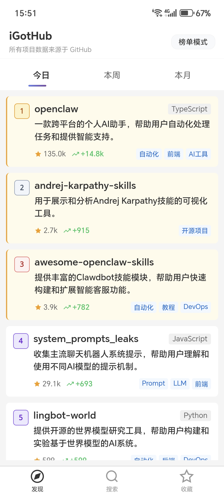
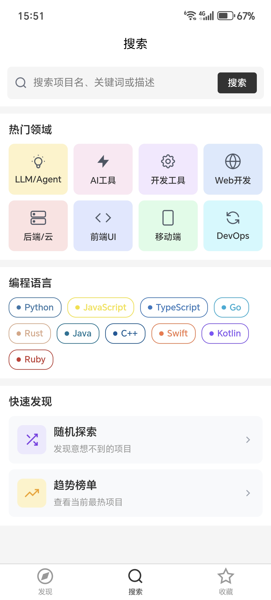

# iGotHub

<p align="center">
  
</p>

<p align="center">
  <strong>发现 GitHub 热门开源项目的最佳助手</strong>
</p>

<p align="center">
  <a href="#下载安装">下载 APK</a> •
  <a href="#功能特点">功能特点</a> •
  <a href="#截图预览">截图预览</a> •
  <a href="#技术栈">技术栈</a>
</p>

---

## 产品简介

**iGotHub** 是一款帮助中文用户发现 GitHub Trending 开源项目的移动应用。

- 🚀 **无需登录**，打开即用
- 🏆 **榜单模式**：今日/本周/本月热门项目排行
- 🔀 **探索模式**：随机发现优质项目
- 🤖 **AI 总结**：自动生成中文项目描述
- 🏷️ **智能标签**：按领域和语言快速筛选
- ⭐ **多收藏夹**：自定义分类管理收藏

---

## 下载安装

### Android APK

| 版本   | 下载链接                                                   | 更新日期   |
| ------ | ---------------------------------------------------------- | ---------- |
| v1.0.0 | [GitHub Release](https://github.com/LinkDry/iGotHub-releases/releases) | 2026-02-01 |

> 💡 首次安装需要允许"安装未知来源应用"

### 其他平台

- 🌐 **Web 版**：开发中...
- 🍎 **iOS 版**：规划中...

---

## 功能特点

### 📊 榜单模式

查看 GitHub 实时热门项目，支持今日、本周、本月三个维度的排行榜。

### 🔍 智能搜索

按项目名称、描述、标签搜索，支持 8 大热门领域和 10 种编程语言筛选。

### 📖 README 预览

直接在 APP 内查看项目 README，支持代码高亮和图片渲染。

### 📤 分享功能

一键复制链接或生成精美分享卡片，方便分享给朋友。

### ⭐ 多收藏夹

创建多个收藏夹，自定义图标和颜色，轻松管理感兴趣的项目。

---

## 截图预览

<p align="center">
  
  
  
</p>

<p align="center">
  <em>榜单模式 | 搜索页面 | 收藏夹</em>
</p>

---

## 技术栈

| 层级    | 技术选型                                  |
| ------- | ----------------------------------------- |
| 前端    | uni-app (Vue 3) + Vite                    |
| 后端    | Python + FastAPI                          |
| 数据库  | SQLite + SQLAlchemy                       |
| AI 服务 | SiliconFlow (Qwen) + DashScope (通义千问) |
| 部署    | 腾讯云 + Nginx + HTTPS                    |

---

## 本地开发

### 后端启动

```bash
cd igothub-server

# 创建虚拟环境
python -m venv venv
source venv/bin/activate  # Windows: venv\Scripts\activate

# 安装依赖
pip install -r requirements.txt

# 配置环境变量
cp .env.example .env
# 编辑 .env 填入 API Key

# 启动服务
uvicorn app.main:app --reload
```

### 前端启动

```bash
cd igothub-app

# 安装依赖
npm install

# 启动 H5 开发服务
npm run dev
```

---

## API 文档

后端 API 文档：https://igothub.online/docs

---

## 项目文档

- [项目进展记录](docs/PROGRESS.md)
- [部署运维指南](docs/DEPLOYMENT.md)
- [本地打包指南](docs/LOCAL_BUILD.md)
- [BigQuery 配置](docs/BIGQUERY_SETUP.md)

---

## 版本历史

| 版本   | 日期       | 更新内容     |
| ------ | ---------- | ------------ |
| v1.0.0 | 2026-02-01 | 首个正式版本 |

详细更新日志请查看 [PROGRESS.md](docs/PROGRESS.md)

---

## 许可证

MIT License

---

## 致谢

- [GitHub Trending](https://github.com/trending) - 数据来源
- [uni-app](https://uniapp.dcloud.net.cn/) - 跨平台框架
- [FastAPI](https://fastapi.tiangolo.com/) - 后端框架
- [SiliconFlow](https://siliconflow.cn/) - AI 服务

---

<p align="center">
  Made with ❤️ by iGotHub Team
</p>


